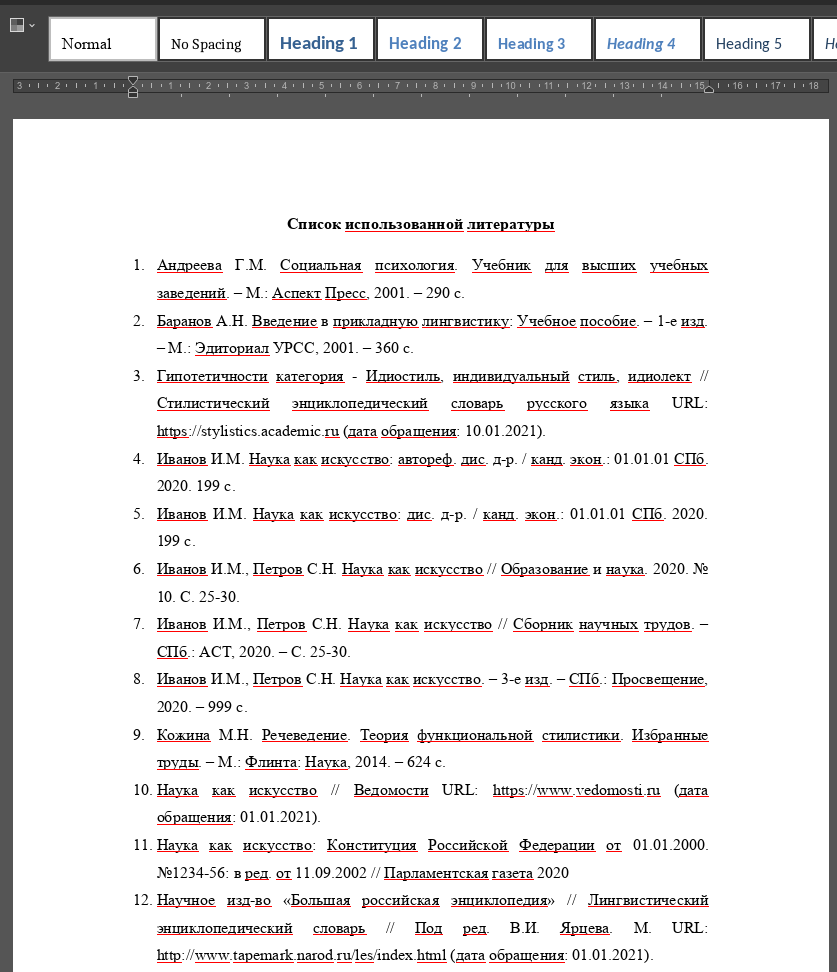
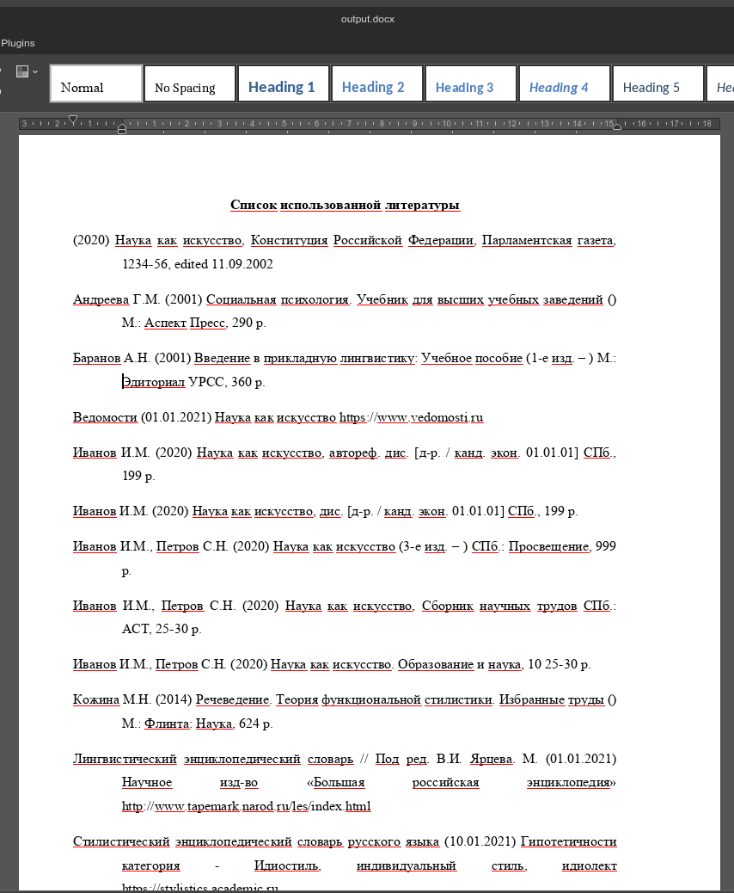

# Table of Contents

1.  [Что было сделано](#org56c39ec)
    1.  [Стиль ГОСТ](#orgc97fee3)
    2.  [Стиль APA](#orgd9a47a7)

# Что было сделано

-   Оформлено цитирование ГОСТ для нормативного акта, диссертации, автореферата, статьи из журнала
-   Оформлено цитирование APA для книги, интернет-ресурса, сборника статей, нормативного акта, диссертации, автореферата, статьи из журнала
-   Добавлены тесты
-   Обновлена документация

    make all

## Стиль ГОСТ

## Стиль APA

